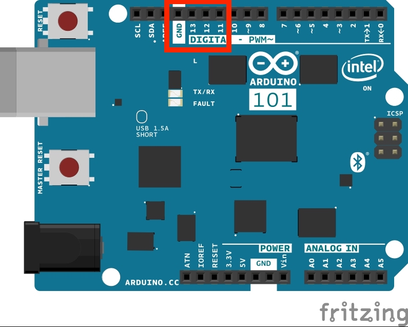
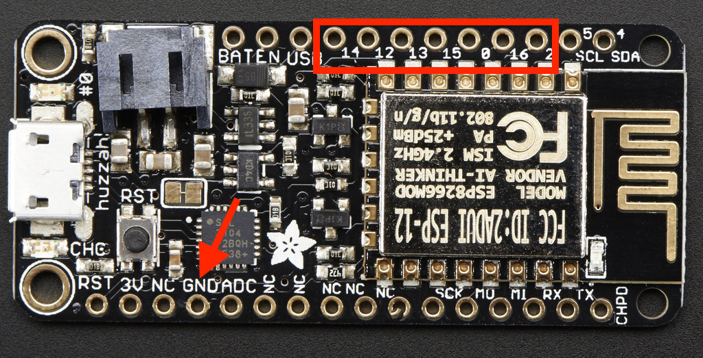

# Arduino Traffic Lights

Experimenting with Arduino Boards and Low Voltage Labs Traffic Lights.

## Introduction

I wanted to try the Low Voltage Labs [Traffic Lights for Arduino and Breadboards](https://www.amazon.com/dp/B07N7V3VWS) using a couple of different types of Arduino that I had on hand:

* [Arduino Uno](https://www.arduino.cc/en/Guide/ArduinoUno): Ideal for trying the lights by plugging them straight into the headers already attached to the Arduino.  This board uses a USB B port for its power and data connection to the Arduino IDE.
* [Adafruit Feather Huzzah ESP8266](https://learn.adafruit.com/adafruit-feather-huzzah-esp8266/overview): Ideal for trying the breadboard approach as the board has leg like headers that attach all the pins to a breadboard.  This board uses a micro USB port for its power and data connection to the Arduino IDE.  Note you need to buy the version of the board with the headers attached unless you want to solder your own on there.

In common with the various traffic light demos I built using a Raspberry Pi and different programming languages, I wanted to show how to get the traffic lights to show the UK light pattern:

* Red
* Red + Yellow
* Green
* Yellow
* repeat...

If you're interested in how to program the traffic lights for the Raspberry Pi, check out one or more of these articles:

* [Python](https://simonprickett.dev/playing-with-raspberry-pi-traffic-lights/)
* [Node.js](https://simonprickett.dev/raspberry-pi-coding-with-node-js-traffic-lights/)
* [Node RED](https://simonprickett.dev/raspberry-pi-coding-with-node-red-traffic-lights/)
* [Java](https://simonprickett.dev/playing-with-raspberry-pi-gpio-pins-and-traffic-lights-in-java)
* [C](https://simonprickett.dev/gpio-access-in-c-with-raspberry-pi-traffic-lights)
* [Go](https://simonprickett.dev/raspberry-pi-coding-in-go-traffic-lights)
* [Swift](https://simonprickett.dev/raspberry-pi-coding-in-swift-traffic-lights/)
* [BASH Scripting](https://simonprickett.dev/controlling-raspberry-pi-gpio-pins-from-bash-scripts-traffic-lights)

## Arduino Hardware Setup

### Arduino Uno

Hardware setup for the Arduino Uno is straightforward... it's already set for working with the Arduino IDE, so no need to install a different bootloader or anything.  It also has headers attached, so connecting the traffic lights is a simple matter of plugging them in.

The lights need to be attached to a ground pin followed by three digital pins that we'll use as outputs.

Looking at the diagram above, we want to attach the lights so that the ground pin attaches to ground, meaning the red light will be on pin 13, the yellow on 12 and the green on 11.  This is the only place on the Uno that this sequence of pins occurs.

### Adafruit Feather Huzzah ESP8266

The Feather Huzzah differs from the Arduino Uno in a few ways...

* The headers are more like legs rather than the stacking / socket type on the Uno... so the lights won't plug directly into them... we'll use a breadboard.
* The layout of the pins differs from the Uno, and the pins we need aren't located adjacent to each other.  We'll solve this using jumper wires on the breadboard.
* The board ships with a Lua interpreter, but we want to use the Arduino IDE and write C.  To do this, we'll need to re-flash the board which [Adafruit provides a handy guide for](https://learn.adafruit.com/adafruit-feather-huzzah-esp8266/using-arduino-ide).
* It is 3.3v logic not 5v, so we can expect the lights to be a little dimmer than with the Uno.  This is also true of the Raspberry Pi that's 3.3v too.

Here's a pinout for the Huzzah showing where the pins we'll need are:

TODO breadboard setup...

## Arduino Development Environment Setup

We'll need the [Arduino IDE](https://www.arduino.cc/en/Main/Software)... I found on Mac OS Catalina I had to get the latest beta version to avoid issues compiling code later on.  This is related to the 64 bit nature of newer Mac OS releases.

### Setup for the Ardiuno Uno

There should be nothing more needed for the Arduino Uno... if you connect it to your maching using a USB A<->B cable and choose "Arduino Uno" as your board and the appropriate USB port as your port that's all you need to do.

If your development machine doesn't run Mac OS you may need to perform different and/or additional steps.  Those, plus a guide on how to set the board type and port can be found on the [Arduino Getting Started page](https://www.arduino.cc/en/Guide/HomePage).

### Setup for the Adafruit Huzzah ESP8266

The Adafruit board requires you to download a driver and get the ESP8266 board package for the Arduino IDE.  There's a [guide for this over at Adafruit](https://learn.adafruit.com/adafruit-feather-huzzah-esp8266/using-arduino-ide).

## Coding

TODO

## Deployment to the Arduino Boards

TODO
